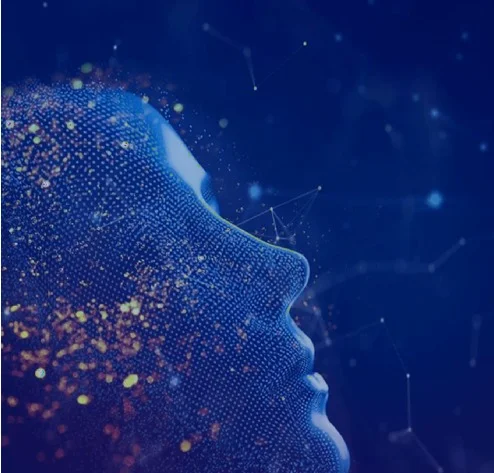

Digital transformation is not just a technological renewal, but the redesign of the institution's value generation model, decision-making mechanisms and organizational DNA.

As Luvi, we position ourselves as a strategic solution partner in the digital transformation journeys of institutions; we design and implement data-driven, agile and sustainable transformation models. Our approach aims to offer a holistic transformation architecture covering all stages from analysis to implementation, from competency development to governance. Our goal is to take digital transformation out of being an abstract vision and turn it into measurable business results and lasting competitive advantage.

## Digital Transformation Maturity Analysis and Strategic Roadmap
The starting point of an effective transformation is the evaluation of the current situation with a multi-dimensional and analytical approach. In this context:
* The digital maturity of the institution is comprehensively analyzed in the dimensions of organizational structure, business processes, technology infrastructure, data management and human resources.
* The gaps between the current situation and the targeted vision (gap analysis) are clearly revealed.
* An institution-specific, prioritized and phased Digital Transformation Roadmap is created.
* Digital initiatives and project portfolio are determined in line with strategic impact and applicability criteria.
* Depending on the need, international methodologies such as TÜBİTAK TÜSSİDE DDX or DIGITOPIA are used in the analysis process to obtain objective and comparable results.

## Transformation Guidance and Integrated Project Management
The success of digital transformation is directly related to the disciplined implementation of the strategy and effective governance. In this regard:
* The determined transformation initiatives are structured with internal teams and implemented from end to end.
* Program and project management methodologies are applied; time, budget and scope management is secured.
* The transformation program is aligned with strategic objectives, ensuring that all projects serve corporate priorities.
* In the selection of technology and solution providers, consultancy is given to create the ecosystem most suitable for the needs of the institution.
* Seamless integration between processes and continuity of data flow is ensured, guaranteeing the holistic operation of the digital architecture.

## Competency Development and Building a Digital Culture
Permanent transformation requires the transformation of human resources as well as systems. In this context:
* Strategic perspective and transformation leadership competencies are developed with Digital Leadership programs for the management staff.
* Digital Transformation Ambassador programs are designed for operational teams, ensuring that the transformation spreads throughout the institution.
* Training is provided in critical competency areas such as data literacy, agile working methodologies and innovation management.
* The learning organization structure is supported within the institution, making the continuous development culture permanent.

## Sustainable Governance and Value-Oriented Monitoring
The fact that digital transformation produces permanent value is possible with a strong governance model and performance tracking. In this regard:
* Governance structures are created for transformation programs, making decision-making processes transparent and effective.
* All projects are regularly monitored and reported through KPIs linked to business goals.
* Data-driven decision-making mechanisms are strengthened, increasing corporate agility and adaptation capability.
* The continuous improvement approach is made systematic for the sustainability of the achieved gains.

As Luvi, we ensure that institutions move their digital maturity to advanced levels, develop innovative business models and produce sustainable value in a rapidly changing competitive environment. As a strategic partner in your digital transformation journey, we are ready to build the future together.
