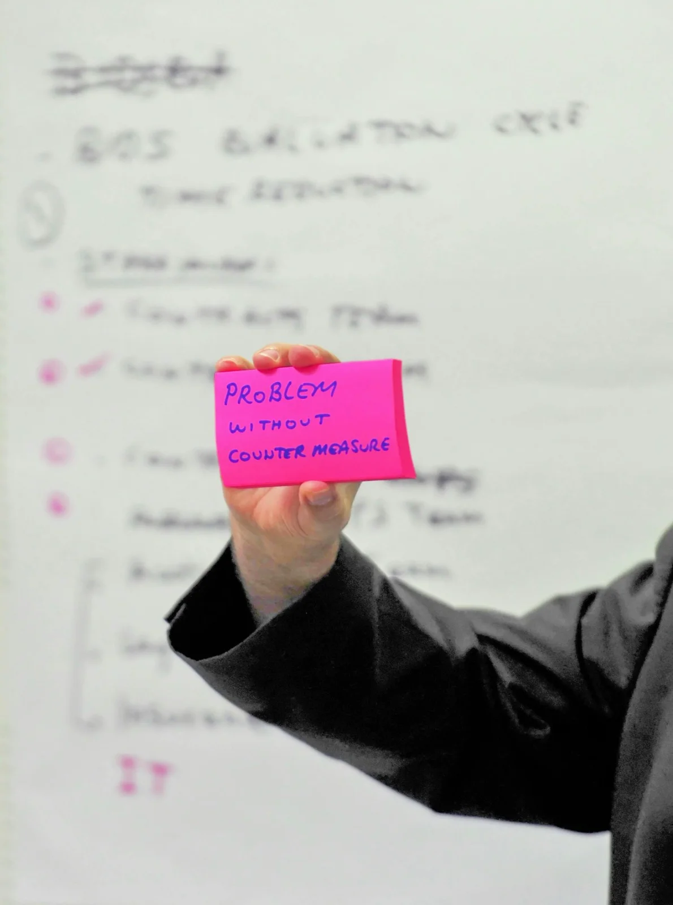
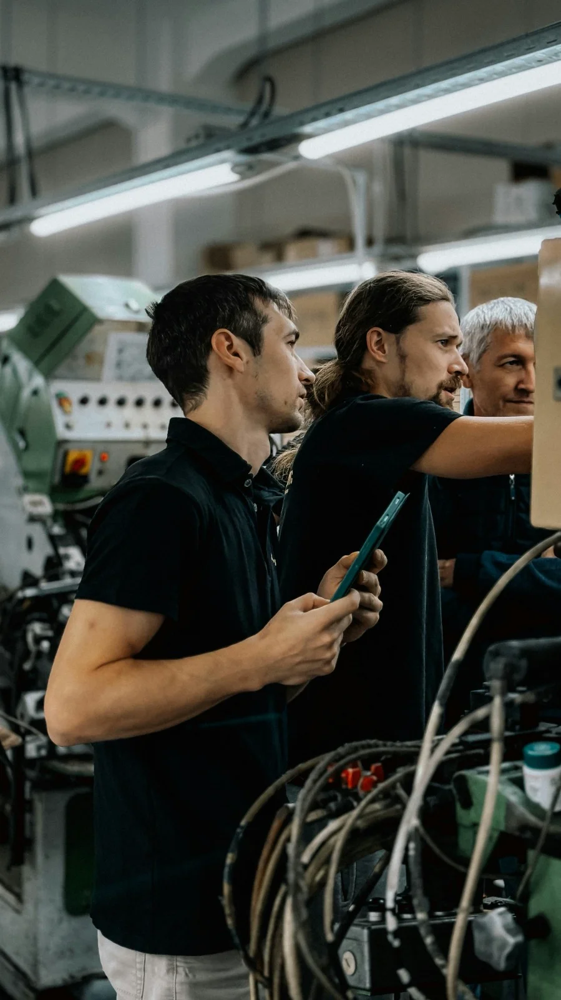
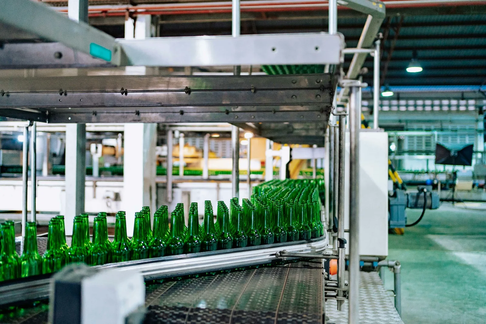

Sustainable success is possible not only by achieving results, but by transforming the systems that produce those results and the mindset of the institution.

As Luvi, we aim to spread the culture of continuous improvement across all layers of the organization, simplify processes, and produce measurable business results in order to increase the competitiveness of institutions and ensure they achieve sustainable success. Our approach is not limited to improving current performance, but is based on establishing a permanent development discipline within the institution.

## Widespread Continuous Improvement Culture
At the heart of the long-term success of institutions lies the systematic development of employees' problem-solving and process improvement competencies. Accordingly:
* By analyzing the current situation throughout the institution, improvement areas and critical problems are determined through structured workshops.
* Continuous improvement, problem-solving techniques, and project management training are planned and implemented for employees.
* Cross-functional teams are formed for prioritized topics, and solution development processes are carried out with the active participation of employees.
* Mentoring and coaching support is provided to teams throughout all improvement projects, strengthening the learning organization structure within the institution.

Thanks to this approach, continuous improvement becomes not just a project, but an integral part of the institution's daily way of doing business.

## Process Improvement and Cost Optimization
To increase operational efficiency, processes must be handled end-to-end and non-value-adding elements must be systematically eliminated. In this context:
* Detailed current situation analyses are performed throughout the company or in specific business units; process flows are examined to identify bottlenecks, inefficiencies, and development opportunities.
* Processes are redesigned with work carried out alongside institution employees, creating lean and effective workflows.
* Non-value-added activities are eliminated, processing times are shortened, error rates are reduced, and service quality is increased.
* Financial losses and sources of inefficiency are revealed through cost analyses; concrete savings are achieved with target-oriented efficiency projects.

As a result of these efforts, both operational performance and financial outputs are measurably improved.

## Sustainability of Gains and Institutionalization
The permanence of the achieved improvement results is possible with a strong governance structure and regular performance tracking. Accordingly:
* The establishment of an executive board (steering committee) structure that will provide strategic direction within the institution is supported.
* By guiding the executive board, prioritization, tracking, and continuity of improvement projects are guaranteed.
* All gains are regularly measured and reported through defined key performance indicators (KPIs).
* By ensuring transparent monitoring of process performances, the data-based decision-making culture is strengthened.

Thanks to this structure, the achieved improvements cease to be temporary gains and are integrated into the institution's standard way of doing business, supporting sustainable success.

As Luvi, our goal is not only to offer improvement projects to institutions, but also to be a strategic solution partner in building organizations that improve themselves, make decisions based on data, and continuously produce value.
